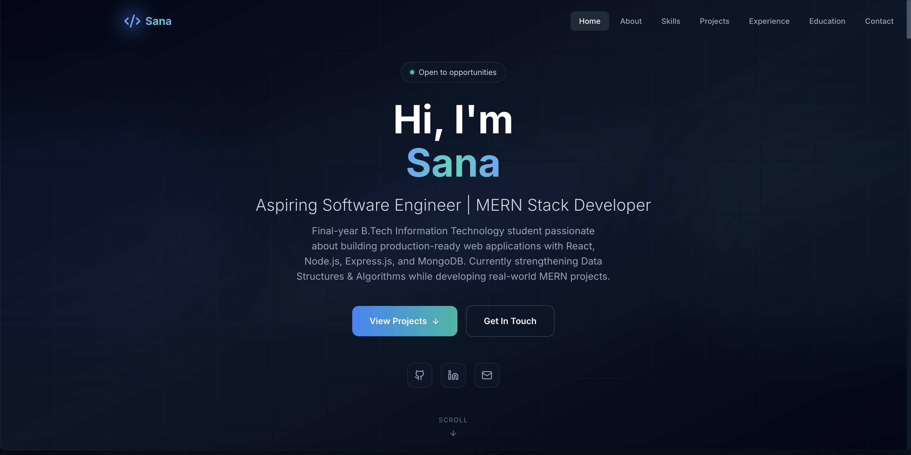

# 🌐 Sana Aijaz | Portfolio



> A modern, responsive full-stack developer portfolio showcasing my projects, technical skills, experience, and software engineering journey.

🚀 **Live Demo:** https://portfolio-zeta-bice-82.vercel.app

This portfolio is built to highlight my work, technical expertise, and passion for developing scalable web applications. This portfolio serves as my personal website, providing recruiters, developers, and collaborators with an interactive platform to explore my projects, technical skills, resume & contact information.

---

## 🚀 Features

- 🎨 Modern and responsive user interface
- 📱 Mobile-first design for all screen sizes
- ⚡ Fast performance powered by Vite
- 🎭 Smooth animations using Framer Motion
- 🌙 Elegant dark theme with glassmorphism UI
- 💼 Project showcase with detailed information
- 🛠️ Skills, Experience, and Education sections
- 📄 Dedicated Resume section
- 📬 Contact form with real-time email delivery powered by Express.js, MongoDB, and Resend Email API
- 🔗 Social media integration
- 🚀 Full Stack MERN architecture with RESTful APIs

---

## 🛠️ Tech Stack

### Frontend
- React 18
- JavaScript (ES6+)
- Tailwind CSS
- Axios
- Vite
- Framer Motion
- Lucide React

### Backend
- Node.js
- Express.js

### Database
- MongoDB
- Mongoose

### Email Service
- Resend Email API

### Deployment
- Vercel
- Render
- MongoDB Atlas

### Development Tools
- Git
- GitHub
- VS Code
- Postman

---

## 🏗️ Architecture

```
React (Frontend)
        │
        ▼
Express REST API
        │
        ├── MongoDB Atlas
        └── Resend Email API
```

---

# 📁 Project Structure

```text
portfolio/
│
├── backend/
│   ├── config/
│   ├── controllers/
│   ├── middleware/
│   ├── models/
│   ├── routes/
│   ├── utils/
│   ├── app.js
│   ├── package.json
│   └── .env
│
├── frontend/
│   ├── public/
│   ├── src/
│   │   ├── components/
│   │   │   ├── layout/
│   │   │   └── sections/
│   │   ├── data/
│   │   ├── App.jsx
│   │   ├── main.jsx
│   │   └── index.css
│   ├── package.json
│   ├── vite.config.js
│   └── .env
│
├── .gitignore
├── README.md
```

---

## 📦 Prerequisites

Before running this project, make sure you have installed:

- Node.js (v18 or later)
- npm
- Git
- MongoDB (Local or Atlas)

---

## ⚙️ Installation

Clone the repository

```bash
git clone https://github.com/Sana9058/portfolio.git
```

Navigate to the project

```bash
cd portfolio
```

Install frontend dependencies

```bash
cd frontend
npm install
```

### Install backend dependencies

```bash
cd ..
cd backend
npm install
```

---

## 🔐 Environment Variables

## Frontend (`frontend/.env`)

```env
VITE_API_URL=http://localhost:5000
```

## Backend (`backend/.env`)

```env
PORT=5000
MONGO_URI=your_mongodb_connection_string
EMAIL_USER=your_email@example.com
RESEND_API_KEY=re_xxxxxxxxxxxxxxxxx
```

> **Note:** Never commit your `.env` files to GitHub.

---

# ▶️ Running the Project

> **Open two separate terminal windows:**
>
> - **Terminal 1:** Start the backend server
> - **Terminal 2:** Start the frontend development server

### Start Backend

```bash
cd backend
npm run dev
```

### Start Frontend

```bash
cd frontend
npm run dev
```

Application URLs

```text
Frontend : http://localhost:5173

Backend  : http://localhost:5000
```

---

# ☁️ Deployment

The portfolio is deployed using modern cloud platforms:

### Frontend
- **Vercel**

### Backend
- **Render**

### Database
- **MongoDB Atlas**

### Email Service
- **Resend Email API**

---

## 📄 Resume

Visitors can view and download the latest version of my resume directly from the portfolio.

---

## 📱 Responsive Design

Fully optimized for:

- Desktop
- Laptop
- Tablet
- Mobile

---

# 🚀 Future Improvements

- 📝 Blog section
- 📊 GitHub contribution graph
- 🔍 Project filtering and search
- 🛠️ Admin dashboard with authentication managing portfolio content
- 🌐 Internationalization (i18n)
- 🎨 Theme customization (multiple color themes)

---

## 🧪 Testing

Currently, automated testing has not been added.

Future versions may include:

- Jest
- React Testing Library
- Supertest

---

## 🤝 Contributing

This is a personal portfolio project created to showcase my work and technical skills. 

Suggestions, improvements, and constructive feedback are always welcome.

If you'd like to contribute:

1. Fork the repository
2. Create a new branch

```bash
git checkout -b feature-name
```

3. Commit your changes

```bash
git commit -m "Add feature"
```

4. Push the branch

```bash
git push origin feature-name
```

5. Open a Pull Request

---

## 👩‍💻 Author

**Sana Aijaz**
- GitHub: [github.com/Sana9058](https://github.com/Sana9058)
- LinkedIn: [linkedin.com/in/aijazsana](https://www.linkedin.com/in/aijazsana/)
- Email: aijazsana1628@gmail.com

---

## ⭐ Support

If you found this project helpful or interesting, consider giving it a ⭐ on GitHub.

It helps support my work and motivates me to build more projects.

---

## 📄 License

This repository contains my personal portfolio website and is intended for showcasing my work and technical skills.

The source code is not licensed for reuse, redistribution, or commercial use without prior written permission.

**© 2026 Sana Aijaz. All rights reserved.**